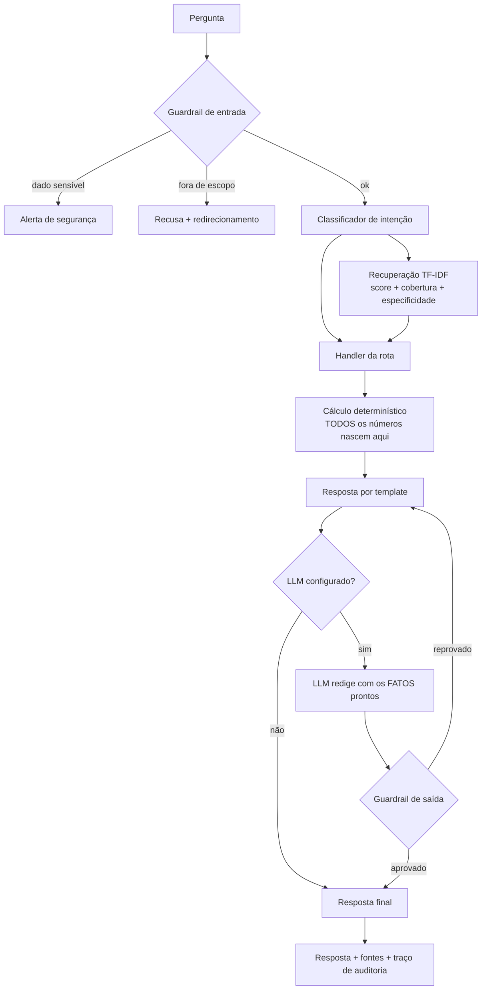

# 🧭 Bússola — Assistente de Educação Financeira com IA Generativa

Assistente virtual que lê os dados financeiros de uma pessoa e responde, em
linguagem natural, sobre a situação dela: para onde o dinheiro está indo, se a
reserva de emergência está de pé, quanto uma dívida vai custar e qual produto
serve para qual finalidade.

**Projeto do Lab DIO — "Construa seu Assistente Virtual com Inteligência
Artificial"** (trilha Bradesco: Dados, Cibersegurança e GenAI).

> **Decisão central do projeto:** o modelo de linguagem nunca toca em número.
> Toda a matemática acontece em código Python testado; o LLM só redige os
> valores já calculados. É o que torna cada resposta auditável — e o que permite
> o agente rodar sem nenhuma chave de API.

---

## Rodando em 30 segundos

Sem instalar nada, sem chave de API, só Python 3.10+:

```bash
git clone https://github.com/NycolasManfrinato/assistente-financeiro-ia-dio.git
cd assistente-financeiro-ia-dio

python src/cli.py                       # modo conversa
python src/cli.py "o que é CDI?"        # pergunta única
python src/cli.py --debug               # mostra rota, fontes e latência
```

Interface web:

```bash
pip install -r requirements.txt
streamlit run src/app.py
```

Verificando o projeto:

```bash
python -m unittest discover -s tests    # 46 testes
python eval/run_eval.py                 # 38 casos de avaliação
```

### Ativando o LLM (opcional)

```bash
cp .env.example .env    # e preencha uma das chaves
export OPENAI_API_KEY="sk-..."     # ou GEMINI_API_KEY
```

Com chave, o mesmo contexto vai para o modelo, que **apenas redige**. Os fatos
continuam vindo da camada determinística, e a resposta gerada passa por um
validador antes de chegar ao usuário. Sem chave, o agente funciona igual, com
respostas montadas por template.

---

## O que ele faz

| Pergunta | O que acontece por trás |
| --- | --- |
| "Quanto eu gastei nos últimos meses?" | Agrega 285 transações por categoria e compara com a régua 50-30-20 |
| "Tenho muitas assinaturas?" | Detecta cobranças recorrentes por repetição de valor entre meses |
| "Minha reserva de emergência está ok?" | Cruza reserva atual com custo fixo e meta declarada no perfil |
| "Onde guardar minha reserva?" | Filtra o catálogo por perfil e restrições, e explica o que ficou de fora |
| "Quanto pago de juros no rotativo?" | Estima o saldo pelos juros lançados e compara com portabilidade |
| "Se eu aplicar 5000 por 24 meses?" | Juros compostos sobre a taxa do produto elegível de maior rendimento |
| "O que é CDI?" | Recupera o verbete do FAQ e cita a fonte |

E o que ele **não** faz — por decisão, não por limitação:

| Pedido | Resposta |
| --- | --- |
| "Qual ação devo comprar?" | Recusa: consultoria de valores mobiliários é atividade regulada pela CVM |
| "O bitcoin vai subir?" | Recusa: não faz previsão de mercado |
| "Investimento com retorno garantido" | Recusa: nenhum produto assegura ganho |
| "Minha senha é 1234" | Interrompe e alerta sobre o risco; nunca pede credencial |
| "Receita de bolo de cenoura" | Abstém-se: "não encontrei essa informação na minha base" |

---

## Arquitetura



### Cinco camadas anti-alucinação

1. **Guardrail de entrada** — barra dado sensível e pedido fora de escopo antes
   de qualquer processamento.
2. **Ancoragem numérica** — o LLM recebe os valores prontos e só os copia.
3. **Portões de recuperação** — além do score, um trecho precisa cobrir ≥ 50%
   dos termos da pergunta e casar em algum termo discriminativo. Sem trecho
   aprovado, o agente se abstém.
4. **Validação de saída** — a redação do modelo é descartada se citar valor
   inexistente, prometer retorno ou omitir a fonte.
5. **Rastreabilidade** — toda resposta carrega fontes, trechos recuperados com
   score, intenção e latência.

O portão de cobertura nasceu de um caso real da avaliação: *"qual a taxa de
câmbio do iene"* casava com o verbete de CDI com score 0,32 — apenas pela
palavra "taxa". Similaridade sozinha não separava; cobertura separa (1 termo de
4). Detalhes em [`docs/02-base-conhecimento.md`](docs/02-base-conhecimento.md).

---

## Resultados

38 casos de avaliação, modo determinístico:

| Métrica | Resultado |
| --- | --- |
| Taxa de aprovação | 100,0% (38/38) |
| Acurácia de intenção | 100,0% |
| Groundedness (nenhum número inventado) | 100,0% |
| Precisão de citação | 100,0% |
| Recusa correta | 100,0% |
| Abstenção correta | 100,0% |
| Latência p50 / p95 | 0,27 ms / 0,48 ms |

Mais 46 testes unitários, todos passando.

**Leitura honesta:** este é um conjunto de **desenvolvimento**, não de teste
cego. A primeira execução deu 33/38; as cinco falhas viraram correção. O número
prova que o agente não regride, não que ele generaliza — para isso faltaria um
conjunto escrito depois do código congelado. Está detalhado, com o histórico das
cinco falhas, em [`docs/04-metricas.md`](docs/04-metricas.md).

---

## Estrutura

```
assistente-financeiro-ia-dio/
├── README.md
├── requirements.txt              # só streamlit; o núcleo não tem dependência
├── .env.example
│
├── data/                         # base de conhecimento (100% fictícia)
│   ├── transacoes.csv            # 285 lançamentos, 6 meses
│   ├── perfil_investidor.json    # perfil, objetivos, restrições
│   ├── produtos_financeiros.json # 8 produtos com risco, liquidez, tributação
│   ├── historico_atendimento.csv # 10 atendimentos anteriores
│   ├── faq.json                  # 15 verbetes conceituais
│   └── gerar_dados.py            # gerador determinístico das transações
│
├── docs/
│   ├── 01-documentacao-agente.md # caso de uso, persona, arquitetura, segurança
│   ├── 02-base-conhecimento.md   # fontes, indexação, estratégia de recuperação
│   ├── 03-prompts.md             # system prompt, exemplos reais, casos-limite
│   ├── 04-metricas.md            # metodologia, resultados, limitações
│   └── 05-pitch.md               # roteiro de 3 minutos
│
├── src/
│   ├── app.py                    # interface Streamlit
│   ├── cli.py                    # interface de terminal, zero dependências
│   └── bussola/
│       ├── config.py             # caminhos e limiares
│       ├── kb.py                 # carga da base e documentos recuperáveis
│       ├── retriever.py          # TF-IDF + cosseno escrito à mão
│       ├── intent.py             # classificação por regras
│       ├── financas.py           # toda a matemática financeira
│       ├── guardrails.py         # validação de entrada e de saída
│       ├── prompts.py            # system prompt e montagem de contexto
│       ├── llm.py                # camada plugável (determinístico/OpenAI/Gemini)
│       └── agent.py              # orquestrador
│
├── eval/
│   ├── dataset.json              # 38 casos rotulados
│   ├── run_eval.py               # harness de avaliação
│   └── relatorio.md              # gerado automaticamente
│
└── tests/
    └── test_bussola.py           # 46 testes, só stdlib
```

---

## Decisões de projeto

**Por que TF-IDF e não banco vetorial.** São 33 documentos. Um índice vetorial
adicionaria dependência, tempo de subida e mais uma peça para falhar, sem ganho
mensurável nessa escala. Em outra escala, a resposta muda.

**Por que o roteamento não usa LLM.** Se a rota fosse decidida pelo modelo, a
mesma pergunta poderia cair em caminhos diferentes entre execuções e a métrica
de acurácia perderia sentido. O custo é declarar os desempates explicitamente; o
ganho é que cada um deles virou caso de teste.

**Por que funciona sem chave de API.** Um projeto de portfólio que exige chave
paga para rodar não é avaliado. O modo determinístico também é o que torna a
avaliação reprodutível.

**Por que as transações ficam fora do índice textual.** "Quanto gastei com
alimentação" não deve retornar as linhas mais parecidas com a pergunta; deve
somar as linhas da categoria. Recuperação semântica é a ferramenta errada para
agregação.

---

## Os 6 passos do desafio

| Passo | Entrega | Onde |
| --- | --- | --- |
| 1. Documentação do agente | Caso de uso, persona, arquitetura, segurança | [`docs/01-documentacao-agente.md`](docs/01-documentacao-agente.md) |
| 2. Base de conhecimento | 5 fontes, indexação, estratégia de recuperação | [`docs/02-base-conhecimento.md`](docs/02-base-conhecimento.md) e `data/` |
| 3. Prompts | System prompt, exemplos reais, casos-limite | [`docs/03-prompts.md`](docs/03-prompts.md) e `src/bussola/prompts.py` |
| 4. Aplicação funcional | Streamlit + CLI sobre o mesmo núcleo | `src/app.py`, `src/cli.py` |
| 5. Avaliação e métricas | 38 casos, 6 métricas, 46 testes | [`docs/04-metricas.md`](docs/04-metricas.md) e `eval/` |
| 6. Pitch | Roteiro de 3 minutos | [`docs/05-pitch.md`](docs/05-pitch.md) |

---

## Aviso

Projeto **educacional**. Os dados são fictícios e os produtos do catálogo não
existem. O agente não constitui recomendação de investimento, não executa
operações e não substitui orientação profissional.

## Licença

MIT — veja [`LICENSE`](LICENSE).
