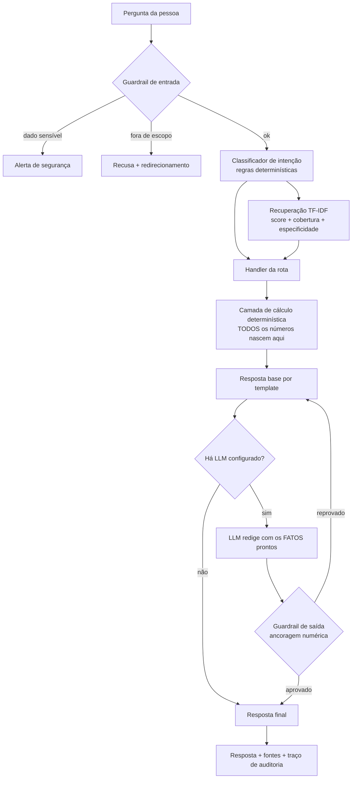

# 1. Documentação do Agente

## Caso de uso

**Problema.** A pessoa que mais precisa de orientação financeira é justamente a
que menos tem acesso a ela. Consultoria personalizada é cara e costuma exigir
patrimônio mínimo; o material gratuito disponível é genérico e não olha para os
dados de ninguém. No meio disso, o rotativo do cartão de crédito — a linha de
crédito mais cara do mercado brasileiro — continua sendo acionado por quem não
percebeu que passou a gastar mais do que ganha.

**O que a Bússola faz.** Lê os dados financeiros da pessoa (transações, perfil,
histórico de atendimento), cruza com uma base de conhecimento de produtos e
conceitos, e responde perguntas em linguagem natural sobre a própria situação:
para onde o dinheiro está indo, se a reserva de emergência está de pé, quanto
uma dívida vai custar, qual produto do catálogo serve para qual finalidade.

**O que a Bússola não faz.** Não indica ativo específico, não prevê mercado,
não promete rentabilidade, não faz declaração de imposto e não executa nenhuma
operação. Essas fronteiras não são detalhe: são o que separa uma ferramenta
educacional de uma atividade regulada pela CVM.

**Cenário de uso da base mockada.** O cliente da base tem renda líquida de
R$ 6.800, gasta em média mais do que isso, tem 6 assinaturas ativas que foram se
acumulando ao longo de 6 meses e começou a pagar juros de rotativo a partir de
maio. A reserva de emergência cobre 2,2 dos 6 meses de custo fixo que ele mesmo
definiu como meta. Todos esses fatos o agente consegue enxergar e explicar.

## Persona e tom de voz

| Atributo | Definição |
| --- | --- |
| Nome | Bússola |
| Papel | Assistente de educação financeira pessoal |
| Público | Cliente de banco de varejo, sem formação em finanças |
| Tratamento | "você", português brasileiro |
| Registro | Direto e acolhedor; frases curtas; sem entusiasmo artificial |
| Jargão | Explicado na primeira aparição ("CDI, que é a taxa de referência da renda fixa") |
| Postura | Nunca julga a pessoa pelos gastos. Descreve o dado e oferece um caminho |
| Limite | Compara características e explica; a decisão é sempre da pessoa |

O tom foi escolhido a partir do público: alguém que já se sente mal com a
própria situação financeira não volta a conversar com um assistente que soa
como uma repreensão. Por isso o agente diz "seus gastos com assinaturas somam
R$ 249,49 por mês" e não "você está gastando demais com besteira".

## Arquitetura

### Decisão central: números não passam pelo LLM

A camada `financas.py` calcula tudo — somas, médias, juros compostos, custo da
dívida, diagnóstico da reserva — e entrega os valores prontos. O LLM recebe esse
bloco de FATOS e tem uma única tarefa: **redigir**. Ele não soma, não arredonda e
não recalcula.

Isso tem três consequências práticas:

1. **Auditabilidade.** Qualquer número da resposta pode ser reproduzido chamando
   a função correspondente.
2. **Reprodutibilidade.** A avaliação roda no modo determinístico e dá o mesmo
   resultado toda vez.
3. **Degradação graciosa.** Sem chave de API o agente continua funcionando: o
   template assume a redação. O LLM melhora a fluidez, não é pré-requisito.

### Por que o roteamento não usa LLM

O classificador de intenção (`intent.py`) e o recuperador (`retriever.py`) são
baseados em regras e TF-IDF. Se a rota fosse decidida pelo modelo, a mesma
pergunta poderia cair em caminhos diferentes entre execuções — e a métrica de
acurácia de intenção perderia sentido. O custo é ter que declarar os desempates
explicitamente; o ganho é que cada um deles virou um caso de teste.

### Componentes

| Módulo | Responsabilidade |
| --- | --- |
| `kb.py` | Carrega as 5 fontes e transforma tudo em documentos com `id` e `fonte` |
| `retriever.py` | TF-IDF + cosseno escrito à mão, com métricas de cobertura e especificidade |
| `intent.py` | Classificação por regras, extração de valor e prazo, detecção de fora de escopo e dado sensível |
| `financas.py` | Toda a matemática financeira; cada cálculo retorna valores **e** fontes |
| `guardrails.py` | Guardrail de entrada e validação de saída (ancoragem numérica, promessas proibidas, citação) |
| `prompts.py` | System prompt e montagem do contexto |
| `llm.py` | Camada plugável: determinístico, OpenAI ou Gemini |
| `agent.py` | Orquestra o turno inteiro e devolve o traço de auditoria |

## Segurança e estratégia anti-alucinação

Cinco camadas, da entrada à saída:

**1. Guardrail de entrada.** Padrões de dado sensível (senha, CVV, token, número
de cartão, CPF) e de pedido fora de escopo (indicação de ativo, previsão de
mercado, promessa de retorno, ocultação de renda) são barrados antes de qualquer
processamento. O agente nunca solicita credencial e alerta se receber uma.

**2. Ancoragem numérica.** Nenhum valor monetário é gerado por texto livre. O
LLM só copia do bloco de FATOS.

**3. Portões de recuperação.** Além do score de similaridade, um trecho só entra
no contexto se passar em dois testes:

- **Cobertura** ≥ 0,5 — o documento cobre pelo menos metade dos termos da
  pergunta. Impede que "qual a taxa de câmbio do iene" seja respondida com o
  verbete de CDI, que casa apenas na palavra "taxa" (cobertura 0,25).
- **Especificidade** ≤ 0,35 — pelo menos um termo casado precisa ser
  discriminativo, isto é, aparecer em menos de 35% do corpus.

Sem trecho aprovado, o agente se abstém: "não encontrei essa informação na minha
base, então prefiro não arriscar uma resposta".

**4. Validação de saída.** Se o LLM redigir, a resposta passa por três
verificações antes de chegar à pessoa: todo valor em reais citado precisa existir
nos fatos calculados; nenhuma expressão de promessa de retorno ou indicação de
ativo pode aparecer; a citação de fonte precisa estar presente. Reprovou, o
sistema descarta o texto do modelo e entrega o template. **A falha do LLM nunca
chega ao usuário.**

**5. Rastreabilidade.** Toda resposta carrega as fontes usadas, os trechos
recuperados com seus scores, a intenção detectada e a latência. Na interface
Streamlit isso aparece no expander "Como cheguei nessa resposta".

### Privacidade

A base é 100% fictícia e versionada no repositório — nenhum dado real de pessoa
alguma. O agente não faz chamadas de rede no modo determinístico. No modo
generativo, o contexto enviado ao provedor contém os fatos agregados e os
trechos da base, nunca credenciais.

## Limitações conhecidas

- Cliente único: a base modela uma pessoa, não um sistema multiusuário.
- Sem memória entre sessões: cada pergunta é independente.
- O classificador é de palavras-chave; formulações muito distantes das previstas
  caem em "desconhecida" — o que é seguro, mas frustrante.
- As taxas do catálogo são fotografias de agosto de 2026 e não se atualizam.
- A avaliação usa o dataset como conjunto de desenvolvimento, não de teste
  cego. Ver `docs/04-metricas.md`.
